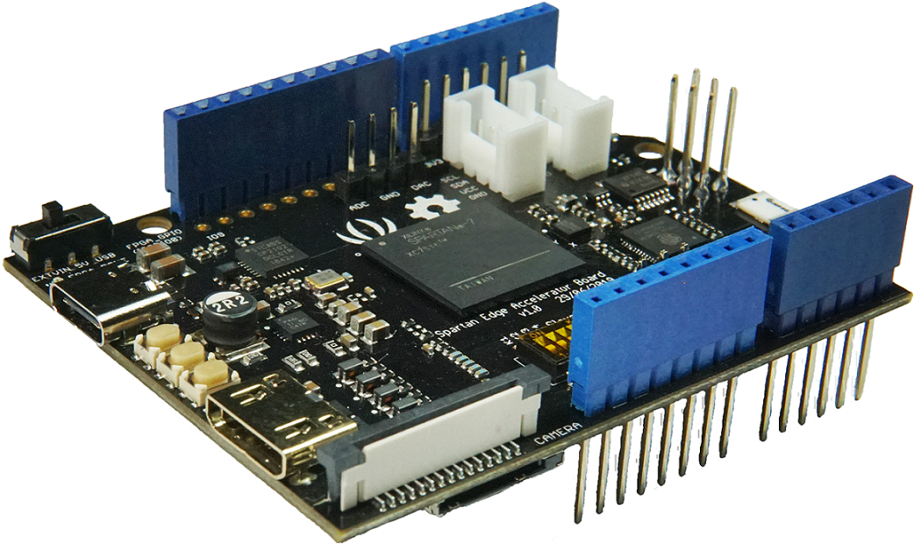

# spartan-edge-esp32-boot
###  a library for Spartan Edge Accelerator Board
The purpose of this library is to load bitstream(FPGA Logic) from SDCard to the on-board FPGA(xc7s15) by the on-board ESP32.

The software development environment is [Arduino IDE](https://www.arduino.cc/en/Main/Software) with [ESP32 Boards support](https://github.com/espressif/arduino-esp32).

## Contents
- [Spartan Edge Accelerator Board](#Spartan-Edge-Accelerator-Board)
- [Arduino IDE ESP32 Boards Support](#Arduino-IDE-with-ESP32-Boards-Support)
- [Library Usage](#Library-Usage)

<br>

## Spartan Edge Accelerator Board
It can be used independently as an Arduino compatible board, or plugged into an Arduino Boards(Arduino UNO eg.) as an auxiliary accelerator board.  


<br>

## Arduino IDE with ESP32 Boards Support

Using these steps, you will be able to talk to the ESP32 part of your Spartan Edge Accelerator Board. This is a prerequisite for the next steps; the FPGA is not involved yet.

___using Arduino IDE Boards Manager___  
Starting with 1.6.4, Arduino allows installation of third-party platform packages using Boards Manager. We have packages available for Windows, Mac OS, and Linux (32 and 64 bit).

- Install the current upstream Arduino IDE at the 1.8 level or later. The current version is at the [Arduino website](http://www.arduino.cc/en/main/software).
- Start Arduino and open Preferences window.
- Enter ```https://dl.espressif.com/dl/package_esp32_index.json``` into *Additional Board Manager URLs* field. You can add multiple URLs, separating them with commas.
  - Stable release link: `https://dl.espressif.com/dl/package_esp32_index.json`  
  - Development release link: `https://dl.espressif.com/dl/package_esp32_dev_index.json`  
  - If you want more details, you can click the [link](https://github.com/espressif/arduino-esp32)
- Open Boards Manager from Tools > Board menu and install *esp32* platform (and don't forget to select your ESP32 board from Tools > Board menu after installation).
- Select ___tool->board->DOIT ESP32 DEVKIT___

Test your setup by building and running a test program (e.g. [one that talks to the serial port](https://www.arduino.cc/en/tutorial/SoftwareSerialExample)). <br>💡 You cannot access the GPIO pins yet, as these are connected to the FPGA not the ESP32.

1. Connect the Spartan Board through USB Type-C wire to the PC, and install USB232 driver (chip CP2102) for your computer's operating system.
1. Turn the power switch (near the USB Type-C slot) to USB side to power on the board.
1. Check serial port and board (___DOIT ESP32 DEVKIT___) as you would do when programming any other Arduino IDE-supported board
1. Copy and paste some code that talks to the serial port into the editor window
1. Open the Arduino IDE's serial console (using the top right button), and ensure that it is tuned to the correct baud speed, as required by the example you are running.
1. Build and upload the code using the 'Upload' button, and watch the result on the serial port.


<br>

## Library Usage

Using these steps, you will be able to tell the ESP32 on the Spartan Edge Accelerator Board to program the FPGA out of a bitstream file on the SD card.

1. ***Library Installation***  

Install this Git repository as an additional library, either from a checked out Git repository or from [the Zip file](https://github.com/sandrobenigno/spartan-edge-esp32-boot/archive/master.zip). See [Installing Additional Arduino Libraries](https://www.arduino.cc/en/Guide/Libraries)

2. ***Prepare SDCard***  
  2.1 Format the SDCard with FAT16/FAT32 filesystem.  
  2.2 Create a top level subfolder named __overlay__ in the SDCard.  
  2.3 Put your bitstream or [sample bitstream](#Sample-bitstreams) files (must have a extend name .bit) into the folder __overlay__.  
  2.4 If you run example 01LoadDefaultBitstream, rename the bitstream file in __overlay__ to __default.bit__.  
  2.5 If you run example 02LoadConfigBitstream, put [**board_config.ini**](extras/board_config.ini) into SDCard root folder.  
  2.6 Insert the SDCard to the Spartan (Edge Accelerator) Board.  

3. ***Upload example***  
  3.1 Connect the Spartan Board through USB Type-C wire to the PC and power it up, as described above.
  3.1 Open Arduino IDE's serial console, and set speed to 115200 baud.
  3.3 Open one of the library examples (01LoadDefaultBitstream or 02LoadConfigBitstream) by Arduino IDE.  
  3.4 Check Board & Port setting in Arduino IDE as described in last section.  
  3.5 Press 'BOOT' Button on Sparton Board and last more than 1 seconds to force ESP32 enter Bootloader mode.  
  3.6 Press 'Upload' button in Arduino IDE to upload the example ('s compiled binary) to ESP32.  <br>💡 At this stage, a mount error is expected on the serial console: <pre>Card Mount Failed,please reboot the board</pre> Just continue following the instructions below.

4. ***Run example***  
  4.1 Make sure the on-board DIP-switch K5 (last one) on Slave(ON) side, which enable FPGA programing by other device(MCU).  
  4.2 Press 'RST' button on Spartan Board to startup the example you just uploaded.  
  4.3 After the example bootup a few seconds, the FPGA_DONE(red color) LED on the board will light on.

<br>

#### Sample bitstreams
Some bitstream/FPGA_LOGIC files we compiled are provided here, you can download them directly.  
  + [spi2gpio.bit](Downloads/spartan-edge-ioex/tree/bitstream/bitstream)  
  GPIO extension controlled by SPI interface, with support of ADC/DAC/RGB-LED, see ***[source code](https://github.com/SEA/Demos/7.Interface/spi2gpio)***.  

<br>

#### Library examples
  + 01LoadDefaultBitstream  
    This example will load SDCard file /overlay/default.bit to FPGA  

  + 02LoadConfigBitstream  
    This example will read a ___ini___ format file /board_config.ini in SDCard,  
    then load the bitstream spcified by the value of key ***overlay_on_boot*** to FPGA.  

